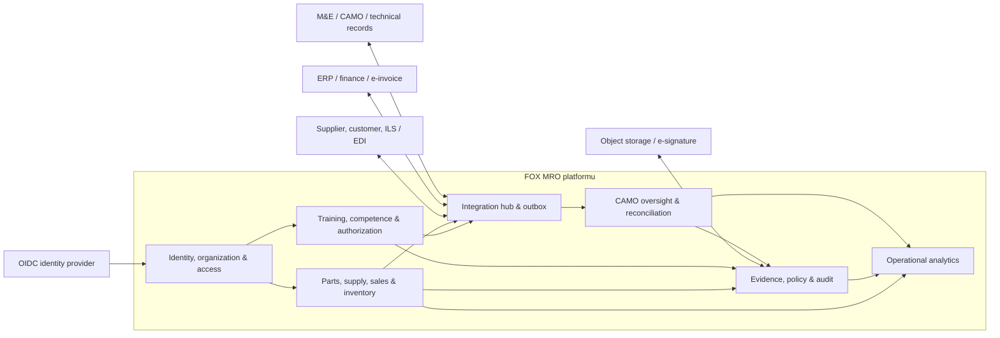
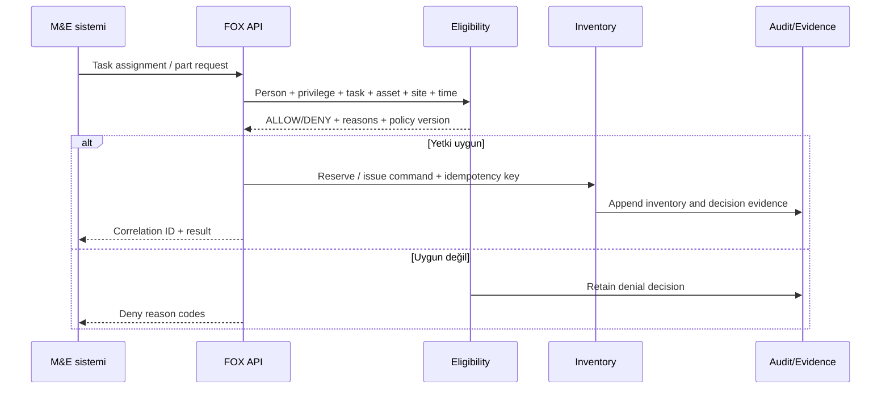

# 05 — FOX MRO hedef mimarisi

## Mimari tez

Başlangıç için **modüler monolit + olay/outbox + açık API** önerilir. Sınırlar kodda, veritabanı sahipliğinde ve API sözleşmesinde uygulanır; yalnız ölçek veya bağımsız release ihtiyacı kanıtlandığında servis ayrılır.



## Bounded context'ler

| Context | Sahip olduğu kayıt | Sahip olmadığı kayıt |
|---|---|---|
| Identity & Organization | Tenant, organization, site, person link, role/policy binding | Parola hash'i; kimlik sağlayıcıda kalır |
| Parts & Effectivity | Part, manufacturer, revision, alternate/interchangeability, applicability | Sertifikalı OEM teknik yayının asıl içeriği |
| Demand & Sourcing | Demand, shortage, RFQ, quote, source decision | Maintenance task'ın teknik tanımı |
| Commercial Orders | Purchase/repair/exchange/loan/consignment/sales order | Genel muhasebe defteri |
| Inventory | Stock item/lot, location, owner, condition, reservation, event | Bakım technical record |
| Evidence & Inspection | Certificate package, receipt inspection, discrepancy, release decision | Dosya binary'si; object storage'da |
| Training & Competence | Course revision, completion, assessment, OJT, qualification | HR payroll |
| Authorization & Eligibility | Authorization scope, suspension, policy snapshot, allow/deny decision | M&E work card execution detayının tamamı |
| Quality & Audit | Finding, action, evidence link, audit bundle | Kuruluşun onaylı MOE metninin yerine geçmez |
| CAMO Oversight | Normalize edilmiş aircraft/configuration/counter/requirement/forecast projection, reconciliation ve exception | M7A'da authoritative technical record veya maintenance release |
| Integration | Connector, mapping version, inbox/outbox, idempotency | Domain kararının içeriği |

## Kritik komut akışı



## System-of-record matrisi

| Veri | Önerilen master |
|---|---|
| Aircraft configuration, AMP/MPD/AD/SB, technical log | Başlangıçta M&E/CAMO sistemi; FOX M7A read model ve fark kaydı |
| CAMO forecast/oversight exception | FOX M7A; kaynak teknik gerçek M&E/CAMO'da kalır |
| Part commercial master ve satış kataloğu | FOX |
| Approved technical effectivity | M&E/OEM kaynağı; FOX kontrollü cache |
| Stock item, location, condition, owner, reservation | FOX |
| General ledger, tax, e-invoice, bank | ERP/finance |
| Course, completion, competence, authorization | FOX Training |
| Person authentication | Identity provider |
| Person employment master | HR; FOX referans ve uygunluk snapshot'ı |
| Certificate/document binary | Object storage / document vault |
| Evidence metadata, hash ve domain links | FOX |

Her alanın tek yazarı vardır. Diğer sistemler cache veya referans tutar; çift yönlü serbest yazım yapılmaz.

## CAMO yetki merdiveni

1. **M7A — Gözetim:** FOX authoritative kaynaktan aircraft configuration, counter, requirement, compliance ve forecast verisini alır; normalleştirir, kendi hesap/projection sonucunu karşılaştırır ve açıklanabilir exception üretir. Kaynak teknik kaydı değiştirmez.
2. **Kontrollü öneri:** Onaylı kullanıcı, FOX'taki farkı kaynak sistemde çözülecek öneriye dönüştürür; entegrasyon otomatik authoritative write yapmaz.
3. **M7B — Yetkili kapsam:** Yalnız veri kalitesi, deterministic calculation, paralel işletim, bağımsız compliance validation, rollback ve MOE/otorite kapıları geçildikten sonra sınırlı domain için writer yetkisi değerlendirilebilir.

Bu merdiven aircraft configuration, AD/SB/AMP compliance ve forecast'ın “bir entegrasyon özelliği” gibi sessizce FOX'a taşınmasını önler.

## Veri ilkeleri

- İş kimlikleri UUID/ULID; kullanıcıya gösterilen numaralar ayrı ve değişmez.
- Tüm kritik command'larda tenant, actor, reason, idempotency key, correlation ve causation ID.
- Inventory hareketi append-only event; düzeltme reversal/compensating event üretir.
- Belge binary'si immutable object key ve SHA-256 ile saklanır.
- Policy ve form şablonları revizyonludur; geçmiş karar kendi sürümüne referans verir.
- Para `decimal + ISO 4217`, miktar `decimal + UOM`, tarih/saat UTC + IANA timezone.
- Soft delete yerine regulated retention state, void/supersede ve gerekçe.

## Güvenlik

- OIDC/OAuth2; uygulama veritabanında reusable parola tutulmaz.
- RBAC + gerekli alanlarda attribute/scope control: organization, site, aircraft type, part class, authorization scope.
- Maker-checker: supplier approval, high-value PO, quarantine release, scrap, price override ve authorization issuance.
- Secret manager, kısa ömürlü token, key rotation ve audit.
- Row-level tenant isolation; testte cross-tenant negative senaryolar.
- Export allow-list, PII masking ve DLP kontrollü raporlama.
- Critical allow/deny kararında “hangi veri ve policy ile?” açıklaması zorunlu.

## Veryon entegrasyonu için anti-corruption layer

Veryon tablo adları veya numeric ID'ler FOX domain'ine sızmamalıdır:

```text
Veryon export/API
  → landing (immutable, encrypted)
  → mapping/validation (versioned)
  → FOX canonical command
  → domain invariant
  → event + reconciliation record
```

Doğrudan Veryon DB'sine yazım yapılmamalıdır. Okuma dahi vendor desteği, sözleşme ve tutarlı snapshot yöntemi ile sınırlandırılmalıdır.

## Gözlemlenebilirlik ve kanıt

- Her workflow için p50/p95 süre, hata ve rework metriği.
- Connector için lag, retry, dead-letter ve duplicate oranı.
- Eligibility için allow/deny oranı ve reason code dağılımı.
- Inventory için negative-prevention, reconciliation ve event sequence kontrolleri.
- Audit bundle: kaynak belge hash'i, command, actor, policy version, approvals ve downstream acknowledgement.
