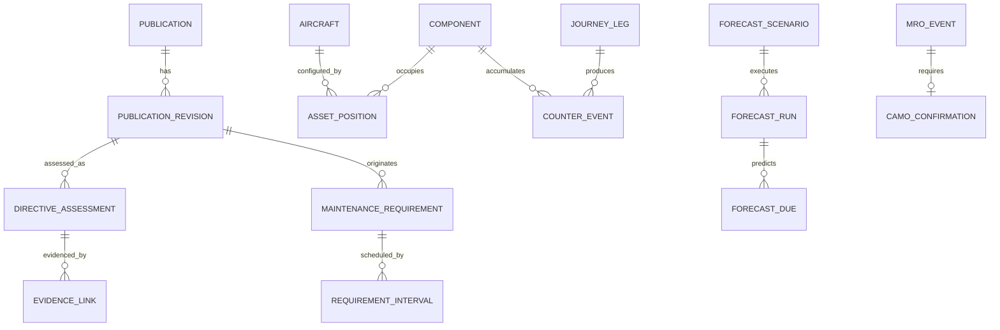

# 09 — CAMO M7 genişleme taslağı

## Karar

Ek Veryon analizi, FOX'ta CAMO için ürün değeri yaratılabileceğini doğruluyor; ancak tam authoritative CAMO sistemini ilk fazda sıfırdan kurma riskini ortadan kaldırmıyor. Önerilen ilerleme iki basamaklıdır:

1. **M7A — CAMO Oversight:** Mevcut M&E/tech-log kaynağından gelen publication, directive, utilization, counter, defect ve due verisini reconcile eden; değerlendirme, kanıt ve açıklanabilir karar üreten read-mostly katman.
2. **M7B — Authoritative CAMO:** Yalnız veri doğruluğu, hesap motoru, e-imza, audit, otorite/MOE onayı ve paralel işletim tamamlandıktan sonra seçilmiş aircraft/product scope'ta master olma.

## M7A bounded context'leri

| Context | Çekirdek kayıt | Kritik invariant |
|---|---|---|
| Publications | Publication, revision, source, effective date, subscription/review | Geçmiş assessment kendi publication revision'ına bağlı |
| Directive Assessment | AD/SB/ASB değerlendirmesi, effectivity, compliance path, AMOC | AMOC ayrı statü değil; approval/evidence/scope taşıyan yol |
| Maintenance Requirements | Task requirement, interval, threshold, source reference | Source/revision değişmeden geçmiş due sessizce değişmez |
| Asset Configuration | Aircraft/assembly/component ağacı ve software config referansı | Aynı zamanda iki aktif parent/location yok |
| Utilization & Counters | Journey leg, tech-log reference, counter delta, correction | Her counter değeri kaynak bacak/okuma ve düzeltmeye izlenebilir |
| Forecast | Scenario, assumptions, horizon, algorithm version, input snapshot | Aynı input + version deterministik sonuç üretir |
| Defect/MEL Oversight | Defect, MEL category, defer/extend/transfer/close evidence | Extension yetki ve limit olmadan due ötelenemez |
| CAMO Confirmation | MRO event confirmation request/decision | Gerekli confirmation olmadan technical closure kabul edilmez |

## Veryon'dan alınan dersler

### Görev ve yayın

- Task requirement için maliyet/man-hour tahmini ve weight-and-balance impact ayrı alt nesneler olmalı.
- AD/SB/ASB/MM/IPC/MPD/AMP ortak `Publication` üst tipini paylaşabilir; assessment davranışı tiplenmiş policy ile ayrılmalıdır.
- Tek, yüzlerce alanlı publication/task tablosu yerine revision, applicability, assessment ve cost impact ayrı aggregates olmalıdır.

### Komponent ve kullanım

- Component ağacı temporal olmalı: parent değişikliği geçmiş configuration snapshot'ını bozmamalı.
- Flight/journey leg primary utilization kaynağı; manuel sayaç düzeltmesi reason, actor, approval ve superseded source taşır.
- Asset status ile warehouse stock condition aynı enum olmamalı; teknik configuration ve lojistik possession bağlanmalı fakat ayrılmalıdır.

### Forecast

Veryon'daki daily/weekly/monthly/yearly ve by-aircraft senaryoları yararlı başlangıçtır. FOX farklılaşması:

- Immutable input snapshot
- Algorithm/version hash
- Scenario approval ve validity window
- Actual-vs-forecast variance
- Due-date change explanation
- Timezone, counter rollover ve missing-leg exception handling

### Quality gate

`QC Inspection`, `QC Verified`, `Requisitioned` ve CAMO confirmation sinyalleri tek status listesine kopyalanmamalıdır. FOX'ta work state, material readiness, inspection state, certification state ve CAMO confirmation ayrı orthogonal state'lerdir.

## Clean-room canonical model

## M7 pilot kabul senaryoları

1. Publication revision değiştiğinde önceki assessment değişmeden kalır ve yeniden değerlendirme kuyruğu oluşur.
2. AD effectivity değerlendirmesi aircraft/configuration/serial aralığıyla açıklanabilir sonuç verir.
3. AMOC yolu approval, scope, validity ve evidence olmadan compliant sayılmaz.
4. Eksik journey leg counter gap üretir; due hesabı sessizce devam etmez.
5. Manuel counter düzeltmesi eski değeri silmez; compensating event ve approval üretir.
6. Forecast aynı snapshot/version ile tekrarda aynı sonucu verir.
7. Component removal/installation temporal tree ve inventory event ile mutabık kalır.
8. MRO closure, gerekli CAMO confirmation olmadan entegrasyonda accepted olmaz.
9. MEL extension authority/limit/expiry ile doğrulanır.
10. Bir aircraft için publication → assessment → requirement → due → work → confirmation kanıt paketi üretilir.

## Veri kaynağı politikası

- Veryon kod tabloları seed olarak kopyalanmaz.
- MSG-3/ATA/OEM/authority sözlükleri lisans ve kullanım hakkı doğrulanarak alınır.
- Kuruluşun MOE/AMP kararı vendor default'undan üstündür.
- Kaynak terim ve kod dönüşümü versioned mapping ile yapılır.
